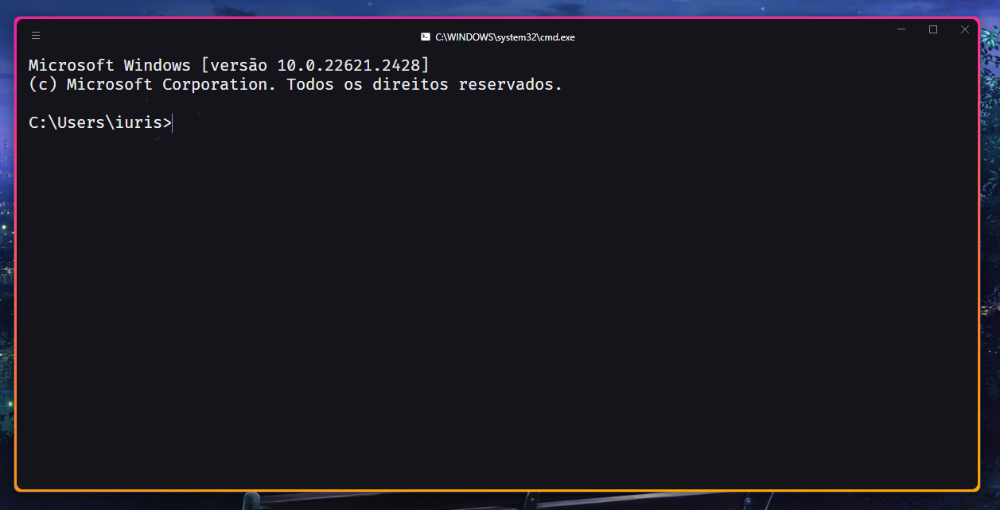

# Hyper Terminal

O <a href="https://hyper.is/">**Hyper**</a> é um terminal de código aberto multiplataforma, projetado para proporcionar uma experiência flexível e visualmente agradável aos usuários, permitindo a utilização de plugins e temas personalizáveis.



Se você deseja configurar o seu terminal da mesma forma que o meu, basta seguir as etapas abaixo e instalar a fonte Fira Code.

**Observação:** Após instalar o Hyper, será necessário reiniciar o seu sistema operacional para a instação dos plugins e tema.

## Instalando o Aura Theme

O Aura Theme é um belo tema escuro com cores vibrantes que pode dar um toque especial ao seu terminal.

```console
hyper install hyper-aura-theme
```

Se preferir, você pode instalar outros temas ou plugins de sua escolha usando o comando:

```console
hyper install [nome-do-tema-ou-plugin]
```

## Instalando plugins

Aprimore a funcionalidade do seu terminal adicionando plugins úteis, como:

Adicionar bordas ao terminal.

```console
hyper install hyperborder
```

Adicionar ícones às guias.

```console
hyper install hyper-tab-icons
```

Adiciona efeito de faísca ao digitar.

```console
hyper install hyperpower
```

Abrir a nova aba no mesmo diretório:

```console
hyper install hypercwd
```

Esses são apenas alguns dos plugins que utilizei no meu terminal Hyper. Você pode encontrar uma lista completa de temas e plugins <a href="https://github.com/bnb/awesome-hyper">aqui.</a>

## Importante

Lembre-se de que sempre que você instala um plugin ou tema, eles são adicionados ao arquivo **.hyper.js**. Se desejar remover algo, basta editar esse arquivo da seguinte forma:

```javascript
plugins: [
  "hyper-aura-theme",
  "hyperborder",
  "hyper-tab-icons",
  "hyperpower",
  "hypercwd",
],
```

## Configurações extra

Além dos plugins e do tema, algumas configurações adicionais foram feitas no arquivo .hyper.js para proporcionar uma experiência mais agradável. Aqui estão algumas delas:

```javascript 
module.exports = {
  config: {
    windowSize: [1216, 600],
    cursorShape: "BEAM",
    fontSize: 20,
    fontFamily: "Fira Code",
    cursorShape: "BEAM",
    cursorBlink: true,
  }
}
```

Todas essas configurações estão disponíveis <a href="https://github.com/iuricode/hyper-terminal/.hyper.js">aqui.</a> Sinta-se à vontade para personalizar ainda mais o seu terminal de acordo com suas preferências, todas essas configurações estão disponíveis para Windows, Linux e Mac.
